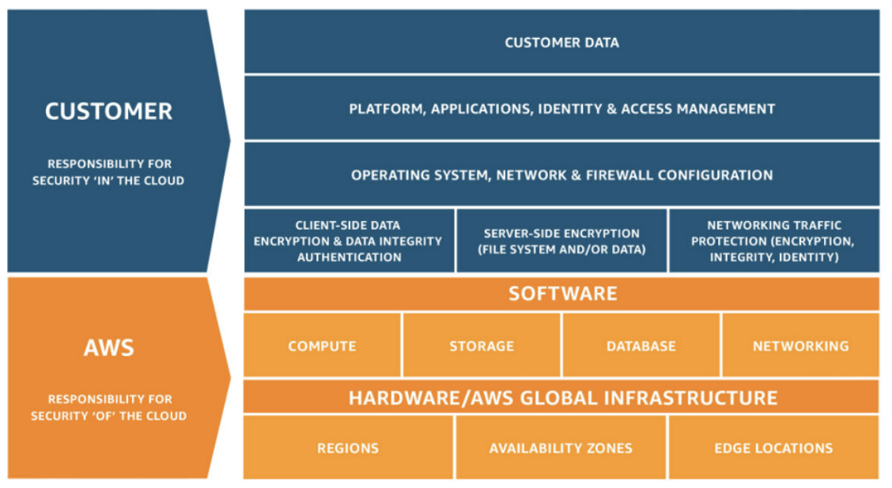

# Component responsibility

## Table of Contents
------  
[Onboarding](#onboarding)  
[User Catalogs](#user-catalogs)
[Scoring](#scoring)
[Tracking](#tracking)
[Content Manager](#content-manager)
[Business Rules](#business-rules)
[Users Domain](#users-domain)
[QR Generation](#qr-generation)
[Data Archiving](#data-archiving)
[Analytics](#analytics)
[Messaging Layer](#messaging-layer)
[Security Concerns](#security-concerns)

## Onboarding

This service will handle the business logic related to the onboarding process, no matter the entity. This means that not only a police officer or civilian will be able to use it but also the merchants, charitable organizations or families in need. Some of the entities will use the web client to signup and create a user account, and others (police officer,civilian) could use the mobile client.

This being said, this component will expose an API to receive the needed information to sign an user up, and of course interact with several components:

- First of all, a component in charge of validating the identity supplied by the user to be created. This is what’s been called an “ID validator” within the conceptual architecture diagram. Depending on the user kind (police officer or civilian, etc), this external provider will definitely vary.    
- Then, an identity provider where the user and its credentials are created after the conditions are met.

Eventually, when the user is finally created and credentials associated, the service will push an event to a broker (Kinesis DataStreams), so every component subscribed can be notified.

*Assumption*

Charitable organization and Family in need catalogs will be provided by external third-party services and held in another local component (user catalogs service), so it can be retrieved whenever needed to validate user creation.

**ADD_DIAGRAM**

### Runtime

This component will live as a **long-live running container** inside the distributed microservice architecture, inside the EKS (Kubernetes Service) data planes. It will be built by using [FastAPI](https://fastapi.tiangolo.com/) and python language.
In this case, as the performance of this component will depend on several internal/external integrations conforming a whole flow that could delayed more than expected, the team considered it suitable to put this logic on an active running container instead of a running-to-completion workload (like a serverless function or job).

### Storage

N/A

## User Catalogs

This component will manage the creation and update of basically two catalogs: the charitable organizations and the families in need.
An integration with probably more than one provider will take place here to get the catalogs at a certain time, and eventually some polling strategy to keep them up to date.

*Assumption* 

The information will be provided by a certified entity in the US soil (e.g. IRS) so the platform can scrape that information. 

**ADD_DIAGRAM**

### Runtime

This component will live as a **long-live running container** inside the distributed microservice architecture, inside the EKS (Kubernetes Service) data planes. As it provides an internal API for supplying information, the team considered to have this logic “alive” and not to put it in a serverless model because of the lack of triggering mechanism (not an external API gateway call, no need to handle an EventBridge trigger, nor a time-based execution).
Like the rest of the cluster containers, it will be built using [FastAPI](https://fastapi.tiangolo.com/) framework over python interpreted language.
It will have a Kubernetes cronjob associated responsible for polling the external providers every now and then so the catalogs are kept the most up-to-date as possible. 

### Storage

Catalogs will be held in a durable datastore so it can be retrieved anytime needed. For this purpose, and based on the nature of the data involved (which can vary among entities), the team picked a non-structural approach, therefore a noSQL engine. To stick with the rest of the decisions in terms of infrastructure and scalability, DynamoDB is the chosen repository. 

## Scoring

Scoring module will be in charge of receiving all transactions between entities, that means:

- interactions between civilians and police officers
- donations to a charity or family in need
- giveaways between police officers
- exchanges (points-to-goods)

Therefore this component has an exposed API to receive that information.

Every kind of transaction relies on certain rules to be applied, rules that exist in another module so it will be an integration between them (synchronous API call).
Those rules (and its conditions) are applied to the supplied information so the platform can do the math and check how many points are assigned to each transaction party.

Then both results are stored on a per-user balance store, which will hold the points balance for every user in the system. 

Finally, every transaction needs to be informed and archived so it is published to the topic within the broker.

**ADD_DIAGRAM**

### Runtime

In this scenario, the team decided to do this calculation on a lambda function to take advantage of the run-to-completion model and save some money by turning it off when there are no transactions to submit.

If the component turns out to be heavily accessed, then it can be kept warm under a time-based ping so cold starts are not a pain (https://acloudguru.com/blog/engineering/how-to-keep-your-lambda-functions-warm).

The code conforming this component will be python as well, global decision unless there is an exception or any other restriction to be aware of. 

### Storage

Team chose a key-value store to hold the user list and corresponding balance (amount of points). The model is straight-forward, unstructured and easy to represent, the low cost (a valuable free tier) and the speed on the access at scale are preferred (a user able to see current balance).  Mainly for these reasons, the team went with DynamoDB instead of other options (e.g. an Elasticache). Not to mention that Dynamo is already targeted by other modules so it won’t be a new service to hire.

## Tracking

One of the core capabilities of the solution, to keep track of the whole list of users and notify them based on proximity so they can interact with each other (civilians with police officers).

There are two main use cases to contemplate:

- every user sending their location frequently, so the system can track everyone’s location and figure out who is near who
- the system notifying a certain person (let’s say civilian) every time a police officer is nearby (it can be defined based on business conditions: radius, range, movement speed, etc), so they can meet and earn some rewards (points).

Main driver of this scenario is to be able to build it fast, which means no need to reinvent the wheel in terms of proximity algorithms, and try to be accurate according to precision.
Integrating with external location platforms and calculating based on GIS parameters does not seem to be the best approach to take.

Of course, mobile integration is quite a driver as well, as this feature is basically mobile-based.

This being said, and in order to delegate to the underlying cloud as much of the effort as possible to make this happen, the team decided to stick with AWS stack which is highly compatible with mobile devices (and the toolkit used to build them in the cloud) and it can also handle notifications based on proximity, which was a must-have in the solution.

**ADD_DIAGRAM**

### Runtime

Runtime layer consists in 2 layers:

- AWS Location Services which will handle all the stuff related to proximity calculation, geofences, geolocation, etc.
- A lambda function in charge of notifying the end user about people around him/her; and keep track of recent locations corresponding to the list of devices connected to the platform. 

### Storage  

This module will store information about the list of devices submitting GPS localization and how it changes in time. Once again, this unstructured data will live in DynamoDB. 

## Content Manager

The solution also needs to support a content manager so the Merchants can manage their own marketplaces and product catalogs, which eventually the people can redeem by supplying points in exchange.

**Money cost** is one of the most important drivers/restrictions of the business requirements so in this case the team chose to hold static assets on a S3 bucket and then make them available globally in the US by creating a CloudFront distribution in front.

## Business Rules

Reference Architecture describes that not only redemptions but also encounters between users may have rules defined by the business in order to establish the amount of points to give to every party in the transaction.

All those rules are handled by a single component, as shown in the technical architecture, and can be changed/adjusted by using a web client. 

Technically speaking, this component will expose basically three APIs:

- creating rules, which can be done by using a web client
- editing/patching rules, same as before
- fetching existing rules and their config, which will be required specially by other components on the solution (CMS & Scoring) so they can operate as expected. 

**ADD_DIAGRAM**

### Runtime

Similar to the user catalogs component, this one will live as a **long-live running container** inside the distributed microservice architecture, inside the EKS (Kubernetes Service) data planes. As it provides an internal API for supplying information, the team considered to have this logic “alive” and not to put it in a serverless model because of the lack of triggering mechanism (not an external API gateway call, no need to handle an EventBridge trigger, nor a time-based execution).
Like the rest of the cluster containers, it will be built using [FastAPI](https://fastapi.tiangolo.com/) framework over python interpreted language.

### Storage

Business rules will be held in a durable datastore so it can be retrieved anytime needed. For this purpose, and based on the nature of the data involved (unstructured, every rule can have different config or conditions to be met), the team picked a non-structural approach, in this case a noSQL document-based store. To stick with the rest of the decisions in terms of infrastructure and scalability, DynamoDB is the chosen repository. 

## Users Domain

This component is key to the solution architecture as it will hold all the domain entities represented in the business logic: **Civilians, Merchants, Police Officers, Families in need, Charity** and the transactions between all of them.

It will expose APIs so it can provide the profile information for every entity involved, but also it will be fed with news about the model (transactions) so it’s able to leave the model up-to-date.

**ADD_DIAGRAM**

### Runtime
Similar to the user catalogs component, this one will live as a **long-live running container** inside the distributed microservice architecture, inside the EKS (Kubernetes Service) data planes. As it holds important information and can be accessed a lot (to get profile data), but algo works as a topic listener, it’s important not to think of this component as a run-to-completion workload.

Like the rest of the cluster containers, it will be built using [FastAPI](https://fastapi.tiangolo.com/) framework over python interpreted language.

### Storage

The main takeout of the model involved in this component is the hard relationships between entities, that makes the team think of a graph model at a first sight.

The model could look like this (nodes and edges with base properties):

*How can we store this?* The quick answer is a native noSQL graph-based db, like Neo4j or AWS Neptune (if we stick to AWS offering).
Actually, the team realized that it could be really hard to maintain this model through time, the regular writes make it very expensive to do so. Not to mention that it could be more expensive, and also that the main use cases covered with this model can also be fetch from a relational database with plain tables and relationships:

- get user/merchant information.
- get all the police officers a civilian has met.
- know all the donations done to a certain family in need.
- know how many goods a certain merchant has sold.

Although the graph model fits the best, the team also considered that the developers needed to integrate and feed this model will be harder to get, with the same expertise on graph modeling as relational models. 

So if the model can be represented as a plain table to hold the 5 different “user” entities and another table to hold transactions (and some utils tables as well), and guarantee they can be searched and joined easily, then there is no need to overdesign putting in there a graph native db, there are more cons than pros.
Therefore, and to follow other decisions about infrastructure, the db engine chosen is Amazon Aurora (Postgres SQL).

## QR Generation

The team decided to represent the idea of a QR to record the encounter between a civilian and a police officer. 
This can be useful in case of:

- automatic instant match based on proximity does not work because of location issues.
- police officers are strongly against submitting their location constantly, so this could be a manual way of earning expected points by saying hello.

*How could this work?* Let’s say a civilian spots a police officer nearby, but not because of the app, which could mean that the officer is not sharing an active location. The civilian can approach and talk to the police officer wondering if he/she would use HeyBlue or even if it’s ok to just “match”. Then, civilians can show a QR which will contain the necessary information to create a transaction between them within the system.

**ADD_DIAGRAM**

### Runtime

This component in charge of creating a distributable QR will need profile information (supplied by the mobile app) and then will return a base64 string conforming the QR image. 

So, it will expose an API and basically compute the QR, which will later return, a great fit for a **lambda function**.

It does not need to be running the whole time, actually. The trigger can be a request received and passed through the gateway, which will wake the lambda and order to execute. 

Because of costs, the team preferred to **develop this in-house** than integrating an external provider, which will add complexity in terms of establishing an egress connection, security, latency, parsing data, etc. On the other side, developing this feature by using a python module can be done easily in no more than 10-15 lines (https://towardsdatascience.com/generating-qr-codes-with-python-in-less-than-10-lines-f6e398df6c8b). 

### Storage  

N/A

## Data Archiving

Every solution needs to hold historical data for several reasons, from legal to technical.
In this scenario, the team considered it prudent to store all the transactions recorded by users, the points given/earned, the goods acquired, the donations made, etc.

This can help anyone to build balance through time, and on the other side for Merchants to track their catalogs, how the stock changed, and which products could be better to offer perhaps.

So it’s important to build an analytics platform backed with accurate and durable information.
   
Therefore, to go with KISS principle, considering the cost is the key driver, the historical datastore will be held in S3 buckets, with proper aging/archiving tiering (glacier, deep glacier). The archiving strategy can be defined together with the business, same as data retention period. 

## Analytics

As described in the previous section, once the durable data is in its place, then it’s time to extract and make decisions out of it.

Main drivers on this choice were:

- ease to setup & maintain.
- no extra effort required, no work in-house.
- spend the least as possible in product licenses/subscriptions.
- no need to learn a bunch of technical stuff to visualize something useful ( https://www.metabase.com/blog/why-a-growth-marketing-team-wants-metabase).
- integrations with AWS analytics services, e.g. Athena (https://www.metabase.com/data_sources/amazon-athena). 
- community adoption & high maturity/support within the industry.

Given all these topics, the team came up with [Metabase](https://www.metabase.com/) as a possible candidate which fits quite well. Actually, the idea is to add Athena as well, as a data extraction tool. 

Following a diagram explaining this scenario:

**ADD_DIAGRAM**

## Messaging Layer

Backing up the [ADR Messaging](../ADRs/adr-messaging-mechanism.md) decision of designing decoupled components to guarantee async flows, thus no extra waiting time for users (a better experience), this section describes how the information is being exchanged through an event broker, in this case Kinesis stack (using Kinesis Data Streams + Data Firehose). 

_Why using both of them?_ Although any of them provides real-time / near real-time stream processing and the ability to scale and handle a bunch of data, there are a few differences to consider and that's why they are usually combined when defining a streaming data pipeline. 

- Kinesis Data Streams provides the data storage needed in case of data loss or corruption on the consumer side, and also nice features like replay capabilities.
- Kinesis Data Firehose makes it easy to load that streaming data into other AWS services, like ElasticSearch, S3 buckets or Redshift. It's like the glue needed to bind all the data not only to suscribed consumers, but also a datastore which can grow exponentially through time (such as a lake or a telemetry tool).

### Stream distribution

In this solution, there are two streams clearly defined: one for user related events and another one for transaction recording.

The first one is filled by the `onboarding component` and notifies an event every time a new user is created and assigned credentials in the platform, therefore that event should reach the `user domain` datastore and also S3 archives, to keep track of every activity.

The second one is basically for every transaction registered by the platform (donations, interactions, redemptions) so the `scoring service` will push every one of them into the proper stream and once again, every suscriber can fetch the data (for archiving/analytics, structured storage in the `user domain` component).

As a resume, to logically separate sets of data, there are separate stream for each dataset.

## Security Concerns

This topic involves handling the security aspects of the whole solution. 

Based on the [ADR Cloud Provider](../ADRs/adr-cloud.md), the team decided to stick to the AWS Well Architected Framework, following the [AWS Security Pillar](https://docs.aws.amazon.com/wellarchitected/latest/security-pillar/security.html).

The design principles include:
- Implementing a strong identity foundation: Well defined privileges for each kind of duty and appropriate authorization on each interaction with the AWS resources, centralizing the identity management. This is implemented on AWS IAM.  
- Enabling traceability: This principle talks about the observability layer, monitoring, auditing, alerting. Metrics and logs are automatically investigated and derived into actions, many times automatically (e.g.: autoscaling). Following the [ADR observability platform](../ADRs/adr-observability-platform.md), this part will be implemented using AWS CloudWatch.  
- Applying security at all layers: Following this principle, our team defines a layer between the external requests and the internal application components, and between internal components as well. Technically speaking, security groups and network ACLs.   
- Automate security best practices: Define a secured architecture and include versioned IaC templates to automate infrastructure allowing to scale faster and manage cost effectively.     
- Protect data in transit and at rest: Define the data sensibility levels and apply the mechanisms to ensure the information when it’s needed.  
- Keep people away from data: Minimize the needs of accessing the data, automatize the data processing to avoid manual intervention procedures.   
- Prepare for security events: Be prepared for an incident, use an incident management tool and processes aligned with the organization model. 

As part of this pillar, AWS will be responsible for the security **of** the cloud, while the customers will be responsible for the security **in** the cloud. 

